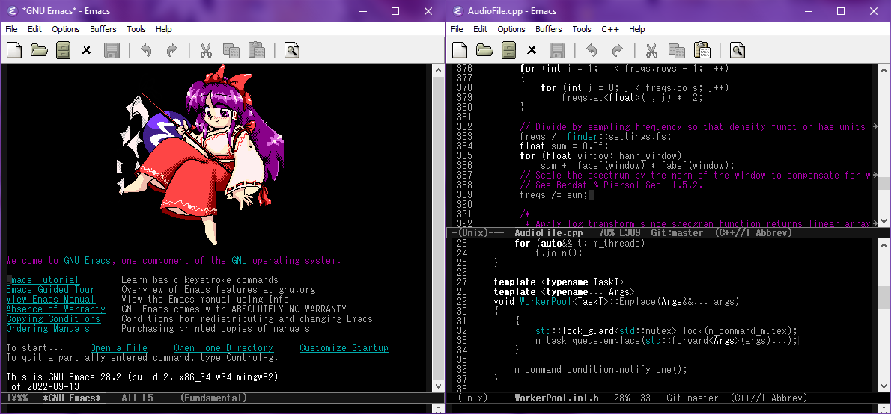

# KP's Emacs Config

This is how I like to use Emacs. Everything's mostly stock but there's a few UX tweaks and language-specific things that make it more intuitive.

## Background

I started using Emacs a few years ago after growing frustrated with [JOE](https://joe-editor.sourceforge.io/)'s lack of extensibility. Having used that editor for years I found the transition to Emacs a little rough, so this config was made to ease the growing pains.

## Notable changes
- [Redo+](https://www.emacswiki.org/emacs/RedoPlus) used to replicate undo/redo behavior from JOE
- [MWIM](https://github.com/alezost/mwim.el) used to replicate traditional Home/End (or C-a/C-e) behavior from other editors
- [sr-speedbar](https://github.com/emacsorphanage/sr-speedbar) added to implement a sidebar (in the same frame) using the built-in "speedbar" feature
- [web-mode](https://web-mode.org/) added for better support for HTML, CSS, JS, PHP, etc.
- [rust-mode](https://github.com/rust-lang/rust-mode) added for Rust support
- [kotlin-mode](https://github.com/Emacs-Kotlin-Mode-Maintainers/kotlin-mode) added for Kotlin support
- [glsl-mode](https://github.com/jimhourihan/glsl-mode) added for GLSL support (along with some hacks to support [bgfx](https://github.com/bkaradzic/bgfx/)'s shader language)
- [cmake-mode](https://github.com/Kitware/CMake/blob/master/Auxiliary/cmake-mode.el) added for CMake support
- [emmet-mode](https://github.com/smihica/emmet-mode) added for quicker HTML editing
- `perl-mode` replaced with `cperl-mode` + Perl syntax highlighting fixes
- JOE navigation keybinds added
- More intuitive keybinds for tab-bar-mode (Emacs 27+)
- Deleted text is no longer copied into the kill ring
- Emacs logo replaced w/ a cute Emacsified drawing of Reimu from [Touhou Project](https://en.touhouwiki.net/wiki/Touhou_Project)

## Installing and customizing

Just clone the repo from `~` (on a *nix) or `%APPDATA%` (on Windows) and you're all set.

The default theme is set to a custom one I've created w/ the font set to Bitstream Vera Mono as well as Tahoma for variable-width text. If you want to change this look for the region labeled "Visual stuff" and adjust accordingly.

If you want to change the startup logo you can also add/remove files via `images/` which Emacs will randomly select from.

### Windows setup

See my article [Fixing Emacs on Windows](https://kpworld.xyz/emacs-on-windows.html) for a quick guide on setting up Emacs to integrate into your system like any other text editor.

Note that some cosmetic stuff is applied based on whether or not it's running in a GUI. If Emacs is started as a daemon, initialization will act the same as if it were started from a terminal. So once a frame is available (i.e. a file is opened after starting the daemon), it may be necessary to reload the config with `M-x load-file` w/ the path to the `init.el` file.
